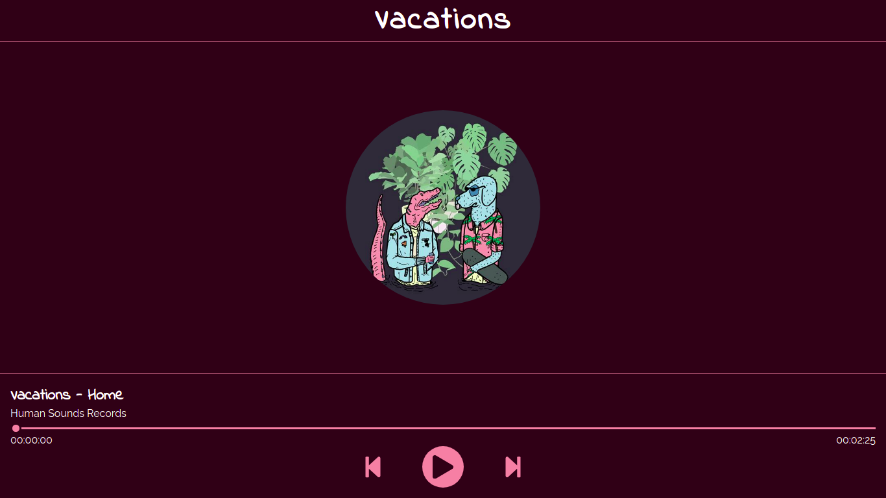

<h1 align="center">
 vacations
</h1>


<h1 align="center">
    
</h1>


<br>

## 🧪 Technologies

This project was developed using the following technologies:

- JavaScript
- CSS

## 🚀 Getting started

Clone the project and access the folder.

```bash
$ https://github.com/Luis-Felipe-N/vacations.git
$ cd vacations
```


The app will be available for access on your browser at http://127.0.0.1:5500/index.html


## Useful resources

- [Criando Player de Áudio com Javascript | Mayk Brito](https://www.youtube.com/watch?v=vqrjFnq3-uo)
- [Audio() MDN](https://developer.mozilla.org/en-US/docs/Web/API/HTMLAudioElement/Audio)
- [audio w3schools](https://www.w3schools.com/jsref/dom_obj_audio.asp)


## 📝 License

This project is licensed under the MIT License. See the [LICENSE](LICENSE.md) file for details.


---

<p align="center">Made with 💛 by Luis Felipe</p>
